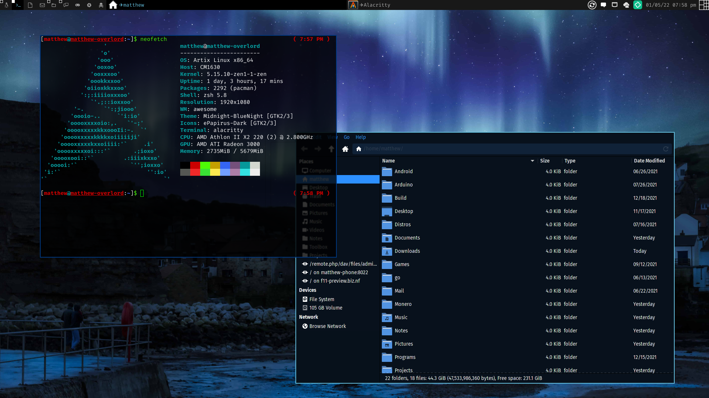

# dotfiles
A repository of my dotfiles

## Precaution with import/update scripts
The update script adds the necessary dotfiles from your home dir and puts it into the current working directory. This is not a script you want to run and is for my use, however you may use the script for your own uses, as well as anything in this repo.
You will want to use the import script, however it is highly recommended that you move the dotfiles yourself, or edit the script, as it will by default wipe your own dotfiles with mine. If you're okay with this, go ahead and do so.
